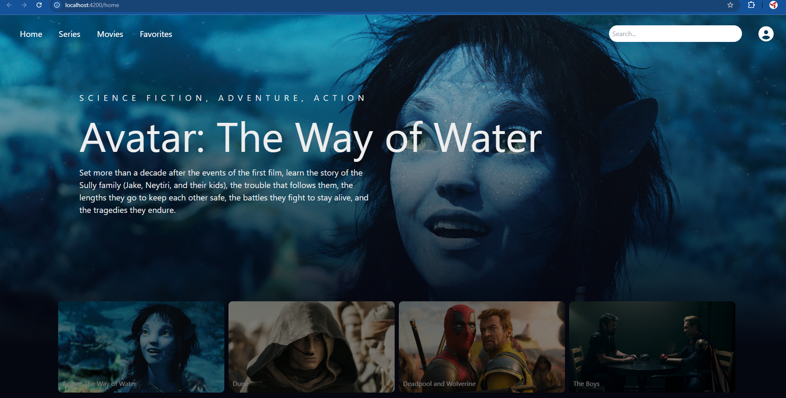
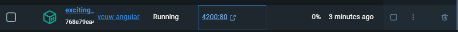

# VeuwAngular

Este proyecto fue generado con [Angular CLI](https://github.com/angular/angular-cli) versión 18.1.0.

## Descripción

Veuw es una aplicación de streaming de películas y series. Está desarrollada utilizando el framework de Angular, HTML, CSS, JavaScript y Tailwind CSS.

## Características

- **Desplazamiento automático**: Una galería de imágenes con desplazamiento horizontal suave.
- **Efectos de Hover**: Al pasar el mouse sobre una película, aparecen opciones de reproducción y me gusta, junto con un título estilizado.
- **Carousel de películas**: Se me ocurrió crear un carrusel que le diera la opción a los usuarios de ver una película random (Actualmente no lo he podido implementar en Angular).
- **Slider de películas**: Opción para ver una gran variedad de trailers de películas hecho con la API de TMDB.
- **Reproductor de video**: En los sliders de las películas se muestra la opción para reproducir video y este te lleva a un reproductor de YouTube.
- **Diseño Responsivo**: Utiliza Tailwind CSS para garantizar que la aplicación sea responsiva en diferentes dispositivos y tamaños de pantalla.
- **Buscador (en proceso)**: Permite buscar películas, pero tengo que cambiar varias funciones.
- **Login y Registro**: Implementado con base de datos SQL Server para manejar autenticación de usuarios.
- **Visualización de Thumbnails**: Muestra películas y series que son tendencia en julio de 2024, cargadas desde la base de datos.

## Tecnologías Utilizadas

- **Angular**
- **HTML**
- **CSS**
- **JavaScript**
- **Tailwind CSS**
- **SQL Server**

## Instalación

1. Clona el repositorio:
    ```sh
    git clone https://github.com/tu-usuario/veuw-angular.git
    ```
2. Navega al directorio del proyecto:
    ```sh
    cd veuw-angular
    ```
3. Instala las dependencias necesarias utilizando `npm`:
    ```sh
    npm install
    ```
4. Inicia la aplicación:
    ```sh
    ng serve
    ```
5. Abre `http://localhost:4200` en tu navegador.

## Uso

1. Al abrir la aplicación, se te pedirá iniciar sesión para que puedas entrar a la ventana principal.
2. Tendrás que registrarte primero y luego iniciar sesión con esas credenciales.


3. Al iniciar sesión, se mostrará la página principal con una selección de películas destacadas.


4. En la parte inferior se mostrará un slider con diferentes películas.
5. Pasa el mouse sobre una película para ver las opciones de reproducción, me gusta y más información.


6. En el header puedes navegar a la sección de series y películas, estos tendrán sliders que cumplen la misma función.

7. En el header podrás ver una sección de favoritos, aquí se guardarán todas las películas y series que marques como favoritas al clickear en el corazón.


8. Podrás ver más información sobre la película al hacer clic en el icono de más información.


9. Si quieres cerrar sesión solo haz hover sobre el icono de perfil y clickea en logout.

10. Utiliza el buscador para encontrar películas y series. Escribe lo que buscas, dale enter y te mostrará una lista de películas y series con esos nombres.


## Proceso que seguí para hacerlo

Primero, decidí en qué versión de Angular implementaría el proyecto. Opté por la versión 18, aunque quizás no fue la mejor elección porque es un poco diferente a las versiones anteriores y es muy reciente, lo que implica que hay menos información disponible al respecto. Sin embargo, aprender esta versión puede ser bueno, ya que se utilizará más en el futuro.

Una vez creado el proyecto, decidí implementar la API de TMDB para hacer que en mis sliders de películas se generara la información de manera automática y más eficiente. Investigué sobre la API e implementé las funciones con TypeScript para obtener información de distintas categorías de películas y series. Esto me llevó bastante tiempo, ya que no sabía mucho de TypeScript, pero finalmente lo logré.

Luego, implementé las funciones para los botones de reproducción de los trailers, favoritos y la información de las películas. Tuve que investigar mucho al respecto, pero se logró. Después, implementé el resto de las funciones de manera similar a las anteriores.

Para el diseño responsivo, decidí utilizar las funciones de Tailwind y CSS para manejar el tamaño del header y el texto del home, haciéndolo responsivo en todos los dispositivos.

## 2do Sprint Review

| ¿Qué salió bien? | ¿Qué puedo hacer diferente? | ¿Qué no salió bien? |
|------------------|-----------------------------|---------------------|
| Se logró hacer la implementación al framework de Angular. | Aprender más sobre Angular 18, ya que actualmente sé muy poco sobre este framework y se me dificultan hacer muchas cosas. | No me dio tiempo a implementar el carrusel de películas y series. |
| Se mejoró un poco el diseño. | Aprender más TypeScript. | El buscador tiene mucho que mejorar. |
| Se implementó la API de TMDB para buscar películas y series automáticamente. | Manejar mejor las rutas. | Tuve problemas con las rutas así que tuve que utilizar `href` en vez de `routerLink` y esto no es óptimo en Angular. |
| Se mejoró el diseño responsivo para todas las pantallas. | Pedir más ayuda. | El rendimiento de la aplicación puede mejorar. |
| Se implementaron todas las funciones a TypeScript. |  |  |
| Se implementó la generación automática de los sliders para reproducir trailers, agregar a favoritos y ver más información. |  |  |
| Se creó un buscador temporal para encontrar distintas películas y series. |  |  |
| Se crearon módulos, componentes y servicios para tener una mejor organización del proyecto. |  |  |
| Se mejoró la seguridad en el login. |  |  |

## 3er Sprint

En este tercer sprint, nos encargamos de agregar el testing para nuestras funciones de JavaScript.

## Tecnologías Utilizadas

- Karma y Jasmine
- RxJS

## Imagen del Testing


## 3er Sprint Review

| ¿Qué salió bien? | ¿Qué puedo hacer diferente? | ¿Qué no salió bien? |
|------------------|-----------------------------|---------------------|
| Agregué testing a todos los componentes. | Cambiar la manera en que los videos de mis películas se cargan. El problema radica en que la API de TMDB no tiene suficientes trailers y tarda demasiado en cargar videos. Para esto, se me ocurre implementar otra API, como la de YouTube, para que lea los nombres de las series y películas y cargue un trailer para estas. Así no tardaría tanto en cargar los videos de las películas y series, y además solucionaría el problema que tengo en el buscador, que a veces algunas películas y series no tienen video. | El tema del performance no se ha mejorado mucho. |
| Agregué el testing para todos los servicios. |  | La API de TMDB no tiene suficientes trailers y tarda demasiado en cargar videos. |
| Se logró que un 90% de los tests pasaran. |  | El buscador a veces no encuentra videos para algunas películas y series. |
| Se implementó RxJS. |  |  |
| Se mejoró un poco más el diseño responsivo. |  |  |

## 4to Sprint

En este cuarto sprint, nos encargamos de integrar la base de datos para el login, registro y visualización de películas en el home.

## Tecnologías Utilizadas

- .NET Core y Entity Framework
- SQL Server
- Visual Studio 2022

## Diagrama de Entidad-Relación de la Base de Datos

## 4to Sprint Review

| ¿Qué salió bien? | ¿Qué puedo hacer diferente? | ¿Qué no salió bien? |
|------------------|-----------------------------|---------------------|
| Se logró integrar la base de datos para el login y registro. | Mejorar la validación de datos al registrarse. | Tuve algunos problemas con la configuración inicial de la base de datos. |
| Se implementó la autenticación con JWT. | Aprender más sobre seguridad en aplicaciones web. | Al principio tuve problemas para manejar la autenticación con JWT. |
| Se muestran películas y series en el home desde la base de datos. | Identificar mejor los problemas. | Me llevó mucho tiempo que se pudieran agregar a favoritos. |
| Se mejoró la seguridad del login y registro. |  |  |
| Se logró una conexión entre ambas APIs para poder guardar las películas y series en la base de datos dependiendo del id del usuario. |  |  |
| Ya no se guardan datos de manera local. |  |  |
| Se implementó el backend utilizando C# y .NET para evitar el retrabajo. |  |  |

# 6to Sprint

## Descripción del Sprint

En este sprint, mi enfoque principal fue la normalización de la base de datos, la implementación de la API con .NET Core y Entity Framework, y la integración de Docker en el frontend. Sin embargo, enfrenté problemas significativos al intentar conectar el backend con la base de datos a través de Docker, lo que impidió completar algunas tareas planificadas.

## Mejoras futuras
-Agregar la funcionalidad para el Forgot password del login
-Mejorar el rendimiento de la pagina
-Mejorar la seguridad en el registro de usuarios
-Mejorar la responsividad para dispositivos muy pequeños y muy grandes
-Implementación del ambiente productivo con kubernetes
-Implementar el testing para todas las nuevas funciones

## Tareas Completadas

### 1. Normalización de la Base de Datos
- **Descripción**: Eliminé la columna `FechaPublicacion` de la tabla `Thumbnails` porque no era esencial para el funcionamiento del sistema.
- **Resultado**: La base de datos ahora está mejor estructurada y optimizada para las consultas realizadas por la aplicación.


### 2. Implementación de la API en .NET Core y Entity Framework
- **Descripción**: Implementé una API utilizando .NET Core y Entity Framework para manejar el login, registro y la visualización de las películas en la página principal.
- **Resultado**: La API permite una gestión eficiente de usuarios y películas, utilizando autenticación JWT para asegurar las operaciones de login y registro.

### 3. Mejoras en el Manejo de Rutas y Funcionalidad de Sliders
- **Descripción**: Realicé cambios en cómo se manejan las rutas en el proyecto para evitar errores en el funcionamiento de los sliders. Anteriormente, estos se bugueaban al cambiar de ruta.
- **Resultado**: Ahora los sliders funcionan correctamente y la navegación es más fluida, mejorando la experiencia del usuario.

### 4. Implementación de Docker en el Frontend
- **Descripción**: Implementé Docker exitosamente en el frontend, lo que facilita la distribución y la configuración de la aplicación en diferentes entornos.
- **Resultado**: Aunque la implementación en el backend no fue posible, el frontend está preparado para futuras configuraciones en ambientes productivos.

## 5. Backend
-Se cambiaron algunas rutas para que funcionen con el docker del frontend y se hicieron avances en el docker para el backend.




- **Repositorio del Backend**: [Ver en GitHub](https://github.com/JaelMartinez/BackVeuw.git)

## Tareas No Completadas

### 1. Implementación de Docker en el Backend
- **Descripción**: Intenté implementar Docker en el backend para asegurar que el proyecto sea portable y fácil de desplegar en distintos entornos. Sin embargo, surgieron problemas al intentar conectar Docker con la base de datos SQL Server.
- **Problema**: No pude establecer una conexión estable entre el backend y la base de datos dentro del contenedor Docker, lo que impidió avanzar en la configuración del ambiente productivo.
- **Solución Propuesta**: Recomiendo investigar más a fondo sobre la configuración de Docker y SQL Server o considerar alternativas como la autenticación con SQL Server en lugar de `Integrated Security`.
### 2. Implementación de kubernetes
-Debido a problemas con el backend no pude continuar

## Sprint Review

| ¿Qué salió bien?                                    | ¿Qué puedo hacer diferente?                                | ¿Qué no salió bien?                                           |
|----------------------------------------------------|------------------------------------------------------------|--------------------------------------------------------------|
| Normalización exitosa de la base de datos.         | Mejorar mi conocimiento sobre Docker y su integración con SQL Server. | No se pudo completar la implementación de Docker en el backend. |
| Implementación de la API con .NET Core.            | Buscar soluciones de docker y kubernetes.           | Problemas de conexión entre Docker y SQL Server impidieron avanzar. |
| Mejoras en la gestión de rutas y funcionamiento de sliders. |                                                           |                                                              |

## Conclusión

A pesar de los problemas enfrentados con Docker, logré avances significativos en la estructura de la base de datos y la implementación de la API. También fue exitoso el enfoque en mejorar la funcionalidad y la estructura del frontend, estableciendo una base sólida para los próximos sprints.

